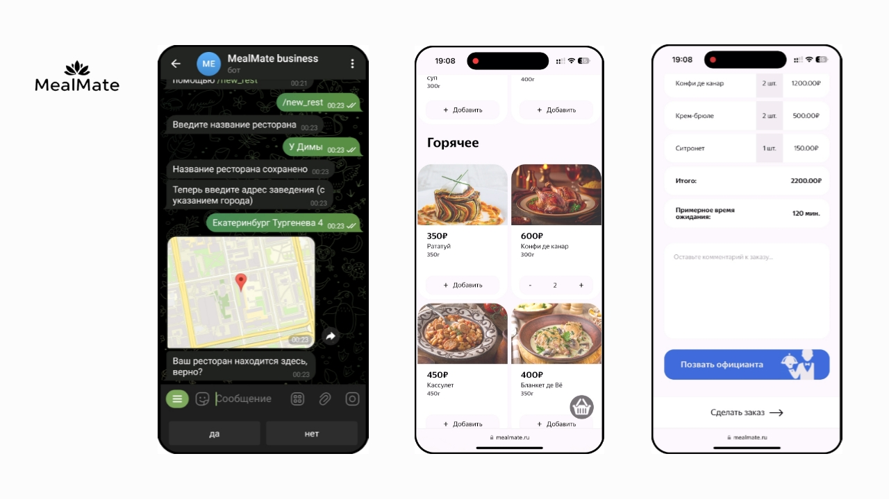

# MealMate

---

MealMate - это сервис для заказа в ресторанах по qr-коду.
Больше не нужно ждать официанта, с MealMate вы сделаете заказ самостоятельно.

 

## О проекте

Как работает MealMate:
1. Владелец ресторана подключает заведение в телеграмм боте.
2. Посетитель сканирует qr со столика и делает заказ на сайте.
3. Уведомление о заказе приходит сотруднику в телеграмм боте.

## Материалы
Для более подробного знакомства с MealMate посмотрите дополнительные материалы:
- [Отчет](https://docs.google.com/document/d/1iN7yBtXYOkwkvsPhK-biX7hhScydkKoQR4brpomv9VY/edit?usp=drive_link) (самодостаточный документ с полным описанием проекта)
- [Презентация](https://docs.google.com/presentation/d/1sIC5mwoeYRS8LvGpkk7ofZ4332MhIZRo/edit?usp=drive_link&ouid=107302260870037543719&rtpof=true&sd=true) (и [презентация без видео](https://docs.google.com/presentation/d/1CCCFV3HT7CSK4clU4cRW9odKIStCUy3i/edit?usp=drive_link&ouid=107302260870037543719&rtpof=true&sd=true) на всякий случай)
- [Текст к презентации](https://docs.google.com/document/d/1Q4TUEE6Ntmfugul2YH7Fi-Ch4EyQnLz3/edit?usp=drive_link&ouid=107302260870037543719&rtpof=true&sd=true)

## Команда
Проект сделан студентами 2 курса ФИИТ УрФУ.
Над проектом работали:
- Владимир Аптер
- Станислав Метляков
- Игорь Шабунин
- Юрий Ромашов
- Георгий Печников

## Контакты

- telegram: [@VladimirApter](https://t.me/VladimirApter)
- email: [vova.apter@yandex.ru](mailto:vova.apter@yandex.ru)

---

MealMate 2025.
